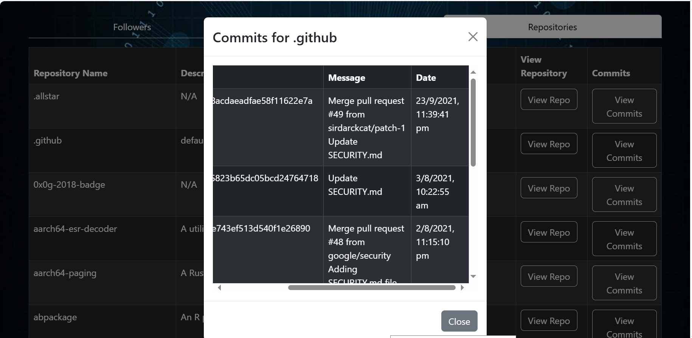

# GitHub User Search

## Overview

Welcome to GitHub API User Search! 🚀 This is a simple application designed to help you explore GitHub profiles quickly and effortlessly. Powered by the GitHub REST API, it fetches user data and presents it in a clean, intuitive interface.

## Features

- **Effortless Search**: Find GitHub users by username with ease.
- **Comprehensive Profile Information**: Get detailed insights into user profiles, including:
  - Username
  - Profile picture
  - Number of followers
  - Number of following
  - Links to repositories
  - Commit History
    
- **Responsive Design**: Enjoy a seamless experience across all devices.

## Screenshots

Check out how sleek it looks:

<div>
    
    
</div>

<div>
    
    
</div>

## Installation

Ready to give it a spin? Follow these steps:

1. **Clone the repository:**

    ```bash
    git clone https://github.com/your-username/Github_API.git
    cd Github_API
    ```

2. **Install dependencies:**

    ```bash
    npm install
    ```

3. **Run the application:**

    ```bash
    npm start
    ```

# Support

Enjoyed using this project? Give it a star⭐! For future project ideas or collaborations, connect with me on <a href="" target= "_blank">LinkedIn</a>.

**THANK YOU 😍**
